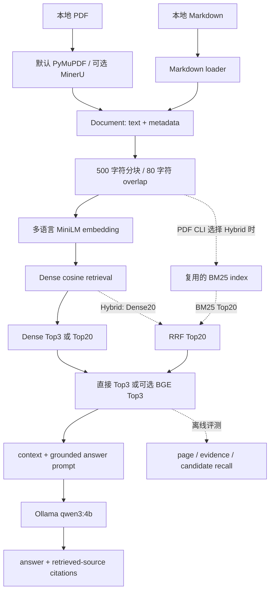

# M10 Architecture Review & Agent Readiness Assessment

审查日期：2026-10-02。代码基准：`8cabb7d`，分支 `codex/m9-hybrid-retrieval`。本报告审查当前实现和冻结实验，不实现功能、不调整参数、不重跑模型推理。案例只使用匿名 ID。

后续状态：本报告建议的最后一轮 [M10.1 parent context 实验](m10-parent-context-controlled-experiment.md)已完成。策略保留 offline，不接 RAG application；后续决定为 **ENTER AGENT**。下文 B 是审查时的前置建议，不是继续增加第二轮 RAG 实验。

## 1. Current Architecture

### 1.1 实际运行路径

评测是离线分支，不是每次生成之后自动验证答案的运行步骤。citation 是检索上下文的来源记录，不是逐条答案的事实验证。

| 入口 / 能力 | 当前真实状态 |
|---|---|
| `src/rag_demo.py` | Markdown Dense RAG；没有 Hybrid selector |
| `src/pdf_rag_demo.py` 无参数 | PyMuPDF、Dense、无 reranker；一次 session 处理一个 PDF |
| `--parser mineru` | 可选 MinerU Advanced + OCR；该 parser 内默认 `structured` |
| `--mode reranker` | 原 Dense20 + BGE Top3 行为 |
| `--mode compare` | 原 Dense 与 Dense+BGE 对照行为 |
| `--retriever hybrid` | Dense20 + BM25 20 → RRF20 → Top3 |
| `--retriever hybrid --rerank` | RRF20 → BGE Top3 |
| selector 冲突 | 旧 `--mode` 与新 selector 混用明确报错 |

“实验中效果较好的路径”和“程序默认路径”不是同一概念。当前默认行为最稳定的是保留兼容性的 Dense；工业 PDF 实验的较强可选组合是 MinerU structured + Hybrid + BGE，但它存在页命中回退和延迟，尚不能称为普遍最优。

### 1.2 数据与表示

- PyMuPDF 默认取每页文本，没有 OCR。MinerU 经本地 runner 产生 MiddleJSON，原始缓存按输入内容和解析设置复用；表示投影不要求重新解析 PDF。
- `document_loader.py` 统一 `text + metadata`；`mineru_loader.py` 合并相邻文本，独立表示 table/image/chart，表格 HTML 转为按行的文本，保留可读 caption/body，排除图片 payload。
- `structured_ocr`、`structured_full` 是 adapter/evaluator 的可选实验表示；普通 PDF CLI 只提供 `flat/structured`。完整模式额外保留 bbox 等定位信息，不等于把视觉语义加入 embedding。
- chunk 有 source/page/block_type/block_index/chunk_id。chunk_id 在 Document 内重新编号；文件 basename 也不是全局永久 document ID。
- 没有完整 section tree、稳定 parent ID、子块字符 offset、结构化 table row/cell 对象。Markdown section map 用于上下文展示，不是 contextual embedding 索引。

### 1.3 模型、排序与资源

Embedding 为 `sentence-transformers/paraphrase-multilingual-MiniLM-L12-v2`；reranker 为 `BAAI/bge-reranker-v2-m3`；生成为 `qwen3:4b`。M8 的视觉模型只在离线实验中使用。

`hybrid_retrieval.py` 仅编排；tokenizer、BM25、chunk identity、RRF 的唯一实现仍是 `lexical_retrieval.py`。冻结参数为 k1=1.2、b=0.75、RRF k=60、等权融合。Dense cosine、RRF、BGE score 不同尺度，不能互比或解释成答案置信度；Hybrid diagnostics 不进入普通 citation。

Dense 默认不初始化 BM25。Hybrid 的 BM25 在 PDF session 内构建一次复用；embedding/model 同样在 session 内复用，但新 session 没有持久 embedding/index 缓存。运行时仍是单 PDF，八文档 corpus 搜索由实验 runner 组织，尚没有正式的多文档 search tool API。

实现依据：[retrieval.py](../src/retrieval.py)、[mineru_loader.py](../src/mineru_loader.py)、[document_loader.py](../src/document_loader.py)、[lexical_retrieval.py](../src/lexical_retrieval.py)、[hybrid_retrieval.py](../src/hybrid_retrieval.py)、[pdf_rag_demo.py](../src/pdf_rag_demo.py)、[rag_demo.py](../src/rag_demo.py)。

## 2. M1–M9 Evolution

| 阶段 | 目标与实现 | 实验 / 结论 | 当前采用状态 |
|---|---|---|---|
| M1 | Markdown loader、chunk、Dense | 历史 50 QA：source Top1 31/50、Top3 36/50、keyword 10/50 | 基础函数保留；不是工业准确率 |
| M2 | 检索上下文 → 本地 Ollama 生成 | 三个手工案例暴露检索覆盖不足 | 基础生成保留 |
| M3 | 来源 citation、检索评测 | 10 QA 来源指标；没有答案正确性评分 | citation/评测保留 |
| M4 | PyMuPDF、页 metadata、统一 Document | 四题 source 4/4、keyword 3/4 | 默认 PDF loader；小样本非工业证据 |
| M5 | 冻结最小 baseline | `v0.5` checkpoint | 历史基准 |
| M6 | MinerU structured、真实工业 PDF 评测 | 八 PDF / 662 页 / 2,996 chunks；Dense page Top3 15/32、evidence 10/32 | MinerU 可选；structured 为其默认表示 |
| M7 | Dense20 + BGE3、匿名失败分析 | page 19/32、evidence 14/32；原失败中修复四例 | BGE 可选；不是所有排序问题已解决 |
| M8.1 | 审计 11 个历史 parsing 标签 | OCR 5、image 2、layout 1、uncertain 3；table structure 0 | 问题定位，无新增运行能力 |
| M8.2 | 已有 OCR/视觉 metadata 保留 | 未恢复目标 evidence；两种增强表示还有指标回退 | 实验模式保留，默认不变 |
| M8.3–4 | 整页 / crop / crop+text 视觉实验 | 整页目标 0/3；四失败 crop 中仅 Q10 恢复；成功 control 通过 | 离线，不接入 RAG |
| M8.5 | 高分辨率 focused OCR | Qwen-VL strict 3/5；RapidOCR 1/5；关联与 GT 问题仍在 | 离线研究，有局部信号 |
| M8.6 | QA-blind gate + VLM A/B | 正例 gate 0/4；formal 31 QA evidence 14/31 无变化 | 不采用该 gate |
| M9.1 | BM25、固定 RRF、五路径 A/B | Hybrid 增候选覆盖；纯 BM25 有 Dense 已成功题回退 | 算法实现保留，先离线验证 |
| M9.2 | 新 21 QA 冻结验证、排序审计 | Hybrid+BGE evidence 15/21 vs Dense+BGE 12/21；page 无净增益 | 支持可选集成，不支持默认替换 |
| M9.3 | 可选 Hybrid 接入 PDF demo | Q01/Q06/Q33 wiring/context/citation/refusal smoke | 已集成；Dense 默认不变 |

历史依据：[M1–M5](m1-m5-summary.md)、[M6](m6-industrial-pdf-evaluation.md)、[M7](m7-reranker-failure-analysis.md)、[M8 audit](m8-document-intelligence-failure-audit.md)、[M8 representation](m8-visual-representation-experiment.md)、[M8 vision](m8-vision-model-feasibility-test.md)、[M8 blocks](m8-vision-block-experiment.md)、[M8 focused OCR](m8-focused-ocr-comparison.md)、[M8 gate](m8-gated-vision-retrieval-ab.md)、[M9.1](m9-hybrid-retrieval-experiment.md)、[M9.2](m9-independent-validation-and-ranking-audit.md)、[M9.3](m9-optional-hybrid-integration.md)。

## 3. Adopted / Optional / Rejected Capabilities

| 状态 | 能力 | 边界 |
|---|---|---|
| 默认运行 | Dense、PyMuPDF、固定 chunk、Qwen 生成、上下文来源 citation | 默认 PDF 不处理扫描 OCR |
| 已集成可选 | MinerU structured、Dense+BGE、Hybrid、Hybrid+BGE | 单 PDF CLI；兼容旧 mode |
| 离线实验 | 全 corpus 检索、匿名 failure export、structured_ocr/full、视觉 crop、focused OCR | 未把视觉结果写入默认 embedding |
| 明确不采用当前方案 | flat 替换 structured、纯 BM25 替换 Dense、M8.6 gate 自动 VLM 增强 | 证据不足或有回退；不等于否定所有后续方案 |
| 未采用且未实现 | Agent、contextual retrieval、parent-child lookup、Qdrant、GraphRAG | 本轮只决策 |

M8.2 的 metadata 保留没有展示检索收益，但不能由此推断 bbox 没有定位价值。M8.6 否定的是当前触发规则，不是所有视觉模型。

## 4. Failure Map

### 4.1 口径与总体结果

M6 的 25 个“失败”来自复合诊断：Top1/Top3 source/page 或 evidence 任一失败即可计入。它不等于 `32 - 10 = 22` 个 normalized evidence miss。M7 的原失败集有三例 Top3 evidence 已成功，故被标记 INSUFFICIENT_DATA，而不是强行称为 reranker 修复。

| 原 M6 25 例的 M7 分类 | Count |
|---|---:|
| FIXED_BY_RERANKER | 4 |
| STILL_RANKING_FAILURE | 3 |
| RETRIEVAL_FAILURE | 4 |
| PARSING_FAILURE | 11 |
| INSUFFICIENT_DATA | 3 |

这些是历史分类，不是 M9 运行后的剩余失败分布。M8.1 将其中 11 例进一步审计为 OCR 5 / image 2 / layout 1 / uncertain 3；没有确认表格拓扑丢失。OCR 表格例中有字段错误，但不能自动归因于表格行列结构破坏。

| 路径 | M9.1 Top3 page | Evidence | Recall@20 | M9.2 Top3 page | Evidence | Recall@20 |
|---|---:|---:|---:|---:|---:|---:|
| Dense | 15/32 | 10/32 | 17/32 | 14/21 | 10/21 | 12/21 |
| BM25 | 20/32 | 15/32 | 20/32 | 18/21 | 14/21 | 16/21 |
| Hybrid | 21/32 | 17/32 | 21/32 | 18/21 | 11/21 | 16/21 |
| Dense+BGE | 19/32 | 14/32 | 17/32 | 17/21 | 12/21 | 12/21 |
| Hybrid+BGE | 23/32 | 17/32 | 21/32 | 17/21 | 15/21 | 16/21 |

M9.1 中 matcher 可用 evidence 为 21 例，M9.2 为 16 例，Hybrid20 均召回全部这些例子。其余“matcher unavailable”不能全部标成 confirmed parsing。M9.1 延用旧 32 QA，同时报告排除 Q17 的敏感性分析；M8.6 正式分母为 31。独立 I17 与历史 Q17 是不同案例。

M9.2 是同八文档的新冻结 QA，不是新 corpus、随机抽样或外部盲测。Hybrid+BGE 相对 Dense+BGE evidence 三例提升、零回退，但 page 两例提升、两例回退。没有证明它在所有文档上普遍更优。

### 4.2 当前可归因的关键限制

| 限制 | 真实证据 | 能解决 / 不能解决的方向 |
|---|---|---|
| 原文未被可靠表示 | M8 OCR/image/layout；视觉整页失败、crop 收益有限 | document intelligence；retrieval 无法创造缺失信息 |
| 字符 matcher 与语义不一致 | Q07 Top1 已有等价 LaTeX 值，formal evidence 仍失败 | 独立评测诊断；不是换 reranker 的证据 |
| 用户缺少范围 | Q19 缺部件/图纸范围；Q24 缺文档身份 | 用户指定 scope / clarification；prefix 不会补出用户意图 |
| child context 不完整 + 候选截断 | Q25 完整表格行在原始 MinerU，但完整行 chunk RRF union rank23 被截；截断片段 RRF14/BGE7 | 可测试 bounded parent/row context；非 confirmed OCR |
| 最终排序仍有 miss | I17 正确候选 rank4 | 尚未证明具体机制；不能直接归因于短块或模型能力 |
| 引用与答案验证缺口 | citations 从 context 汇总；无 claim-level judge | 后续答案/Agent 验收，需要明确事实支持检查 |
| 资源与延迟 | M9 BGE CPU 均值约 34s/query；embedding 冷启动约 136–150s | 先资源复用/延迟预算；不是向量数据库能直接解决 |

Q19 重复文本来自真实不同图纸要求，不宜按相似度自动去重；四个历史 audit case 没有结构身份重复。Q25 weak matcher 接受片段，不等于完整标识符与值的行关系已经恢复。

## 5. RAG Capability Matrix

| 能力 | 现状 | 成熟度 / 主要缺口 |
|---|---|---|
| ingestion/cache | PyMuPDF + 可选 MinerU，raw cache | 工业实验可用；视觉缺失仍在 |
| unified representation | text + provenance；table 行文本 | 无 durable parent/row 语义 |
| Dense / lexical / fusion | 可复用函数，固定参数 | 实验成熟；不是生产服务 |
| reranking | BGE 可选 | 收益真实、成本高、个别回退 |
| metadata scope | source/page/block 保留 | evaluator scope 是 GT 检查；没有运行时公开 filter API |
| generation | Qwen grounded prompt + refusal 指令 | 存在实现；缺系统答案正确性验证 |
| citations | source/page/block 来源 | 不是 claim-level grounding |
| lookup original evidence | loader/raw cache 可访问 | 没有基于稳定 evidence ID 的有界 lookup tool |
| multi-document search session | 离线 runner 支持八文档 | PDF demo 单文档，需薄 session adapter |
| evaluation | 冻结检索、匿名输出、历史 audit | matcher 限制；generation/Agent eval 未完善 |
| agent state/tools | 无 | 不能将当前 demo 直接称为 Agent |

## 6. Missing High-Value RAG Techniques

| 技术 | 机制 / 项目适配 | 决策 |
|---|---|---|
| A. Contextual Retrieval | 为每个 chunk 补充文档上下文后重建 embedding/BM25；可帮助孤立字段，但 Q19/Q24 缺用户 scope，不能靠生成 prefix 确定意图 | 全量 LLM contextual indexing DEFER；先更便宜的 Q25 context 实验 |
| B. Parent-child / small-to-big | 小块搜索，大块恢复上下文；Q25 已有完整表格表示，有直接证据 | **优先做一个有停止条件的离线实验** |
| C. Metadata/scoped retrieval | 用户提供 source/page/对象范围，在候选生成前限制 corpus；不利用 QA GT 偷选页面 | 高价值工具参数；Agent thin adapter 阶段做 source/page scope，设备/section 需真实 metadata 映射 |
| D. ColBERT | token 级多向量 late interaction；新增编码、索引与计算 | DEFER；未证实 BGE 是主瓶颈 |
| E. 新 embedding / learned sparse | BGE-M3、SPLADE 等可改变召回 | DEFER；现有 Hybrid20 已覆盖 matcher 可用题，缺针对当前模型的反证 |
| F. rewrite / HyDE / decomposition | rewrite 可组织查询，decomposition 支持多目标任务；HyDE 生成假想文档 | 有意图状态的 rewrite/decomposition 放 Agent；保留原 query、不得编造 scope。HyDE 暂缓 |
| G. RAPTOR / GraphRAG / KG | 层次摘要或实体关系图服务全局/多跳问题 | DEFER；现有主要是局部字段，没有真实 global/multi-hop benchmark |

原始技术依据：[Anthropic Contextual Retrieval](https://www.anthropic.com/engineering/contextual-retrieval)、[ParentDocumentRetriever](https://reference.langchain.com/python/langchain-classic/retrievers/parent_document_retriever/ParentDocumentRetriever)、[ColBERT](https://arxiv.org/abs/2004.12832)、[SPLADE](https://arxiv.org/abs/2107.05720)、[BGE-M3](https://arxiv.org/abs/2402.03216)、[HyDE](https://arxiv.org/abs/2212.10496)、[RAPTOR](https://arxiv.org/abs/2401.18059)、[GraphRAG](https://arxiv.org/abs/2404.16130)。这些文献说明机制，不提供本项目预期提升数字。当前 BGE reranker v2-m3 不等于采用了 BGE-M3 embedding。

## 7. Context-aware Retrieval Decision

**选择 B：Agent 前再做一个明确的 RAG 实验。**

名称：**Parent Context Controlled Experiment（Agent 前最后一轮 RAG 实验）**。

依据是 Q25，不是“contextual retrieval 很流行”：完整 row 在已有 MinerU 中，当前 accepted candidate 被截断，完整行候选被固定 Top20 截掉。Agent 即便正确选 search tool，也不能从片段可靠还原标识符关联。恢复已有上下文的成本低于重新解析、生成所有 chunk prefix、重建索引或更换模型。

### 最小实验边界

1. 先只读验证 Q25 的 child 能否经 source/page/block identity 唯一回到已有 table Document，并定位其相交的完整 row。若现有 provenance 无法可靠映射，不猜行，标记 insufficient 并停止该方案。
2. 冻结 corpus、原 Hybrid20 candidate IDs、embedding、BM25、RRF、BGE、Top3 和旧 matcher。A 用原 child text；B 只将相同候选的 BGE 输入替换为有长度上限的已有 parent/完整 row 与真实表头上下文。该变量不进入 embedding，不改 chunking，不扩大 candidate 数量。
3. 不能只在最终 Top3 后补文本：Q25 当前 BGE rank7，后补不会使它进入 Top3。必须明确测试 rerank 前的 context 恢复；最终 context/citation 仍记录 child-parent provenance。
4. 主机制 case Q25；已成功 table/text case（含 Q06）做 sanity/regression control；Q19/Q24 做 ambiguity control，不能宣称补 parent 自动解决 scope。I17 仅诊断，先审计再归因。
5. 若进入正式 paired run，复用原 32 QA 与独立 21 QA，旧 Q17 另列敏感性结果。除冻结 page/evidence 指标外，人工检查完整标识符—值—单位的行关联、真实表头、引用定位、token/延迟与上下文稀释。
6. 不改旧 matcher 以制造提升；新增 row-association 诊断单列，不覆盖历史成绩。不要用标准答案选择 parent/row。

收益上限目前只确认一例机制；不能预测全局提升。如果映射失败、只增加长度而未恢复关联，或收益伴随明显回退，则不采用，保留限制并进入最小 Agent。成功也只支持窄 parent context 能力，不支持全量 contextual indexing。**不追加第二轮模型/索引调参来延长 Agent 前置阶段。**

## 8. Agent Readiness

结论：**RAG 主干完整，实验工具可复用；尚未达到直接作为可靠 Agent tool 的接口与验收成熟度。** 主要缺薄接口、有界 lookup、状态/错误协议和答案验证，不缺一个新框架。

### 8.1 工具契约（建议，未实现）

| 工具 | 现有资产 | 最小补齐 |
|---|---|---|
| `search_knowledge` | Dense/Hybrid/BGE 函数、统一 chunks | 预加载多文档 session；query、用户 scope、明确 backend；返回 evidence ID、text、source/page/block、状态、typed score diagnostics |
| `lookup_evidence` | loader 与已有 structured/raw cache | session 内 evidence ID → 有界原始 block/parent；拒绝无效 ID；保留 provenance；不接受任意路径，不每次重解析 |
| 文档范围列举/澄清 | corpus source metadata | 公开可选 source scope；不从 GT 自动补齐缺失意图 |
| 参数/传感器/业务 API | 无真实接口 | 不能在首个 Agent 中假装存在或用模拟工具代替 |

source/page filters 要在 Dense/BM25 候选生成前一致生效，不能只过滤最终 Top3。设备/section 不能仅凭 basename 当可靠标签。session evidence ID 要包含完整身份映射，不能只用 Document 内 chunk_id。

工具输出区分 `ok`、`no_evidence`、`invalid_scope/id`、`timeout/error`；absence 不能混成服务失败。共享模型、embedding、索引，限制 lookup 文本长度和调用数。metadata enrichment 不能隐藏工业原文泄露风险；真实工具日志应保持本地。

现有 `/api/generate` 是文本生成，不是已验证的 tool-calling 协议。进入 Agent 时先验证结构化 action/参数解析与错误处理，不假定 `qwen3:4b` 能稳定执行任意工具调用。

### 8.2 什么才算 Agent

至少具备：按任务选择 search/lookup；保存已覆盖子问题、证据和待澄清 scope；根据结果进入 lookup、再次搜索、澄清或拒答；处理多个用户指定文档来源；有调用预算与结束条件。

固定 search → generate 链外面包一个 graph，不满足以上要求。Agent 也不会修复无法表示的工程图、OCR 错误或无依据参数。

## 9. Candidate Agent Use Cases

### 首选：跨文档证据调查与差异核对

用户指定两个本地文档范围与一个参数/条款核对任务。Agent 分别搜索，查回原 block/完整 row，维护已找到与缺失字段，比较是否存在真实差异；范围缺失时澄清，证据不足时说明不足，输出带来源的核对结果。

真实需求依据：Q19/Q24 的 scope ambiguity、Q25 的查回完整行、现有多文档 corpus。一次 Top3 RAG 不负责分别覆盖多个范围、查回完整行或根据缺失证据澄清；这些条件分支与任务状态才是 Agent 的价值。不是宣称已完成复杂工业推理。两个文档是多个证据来源，不一定是独立事实验证渠道。

最小验收包含：明确 scope 的成功核对、缺 scope 的澄清、缺 evidence 的拒答、冲突证据的分别引用、lookup invalid ID 的恢复。测试问题应提前冻结并人工确认 PDF，不把已有三个 smoke 当 Agent benchmark。

### 后续候选：故障排查证据助手

检索手册并结合用户提供的工况/真实参数 API 组织检查项。当前缺独立可靠运行数据工具和任务 ground truth，因此不作为首个 Agent；不能由文档 RAG 擅自给出安全操作结论。

### 框架选择

| 方案 | 适配判断 |
|---|---|
| 普通 Python tool loop | 轻量，但自由循环易失控，模型 action schema 尚未验证 |
| 简单显式 Python state machine | **首选**：search/lookup/clarify/finish 少量状态，容易设置预算、复现轨迹与测错误分支 |
| LangGraph | 暂缓；持久化、恢复、复杂分支、人工中断成为真实需求时再评估 |

[LangGraph 官方概述](https://docs.langchain.com/oss/python/langgraph/overview)说明其面向有状态、长运行与 durable execution；当前没有证据表明这些能力是第一轮 Agent 的必要成本。

## 10. Technical Debt & Engineering Boundaries

### Agent 前必须处理（薄接口范围）

- search/lookup 输入输出、session evidence identity、scope 校验、明确错误状态。
- 保持资源复用；tool 不启动交互 CLI，不隐式重复 embedding/MinerU。
- 有界调用数、文本长度、超时、无证据/冲突/无效参数路径；工具日志真实资料本地保存。
- 小型冻结答案与 Agent 验收集；citation 是否支持具体结论必须人工检查。

### 后续再处理

- 跨 session embedding 缓存、长期 document/parent/version IDs、正式 section hierarchy。
- `rag_demo.py` 的 reusable generation/context helper 与交互入口逐步分离；现阶段薄 adapter 可复用函数，不需要全 src 重构。
- 实验 runner 的私有 helper 跨文件引用与重复 orchestration；算法没有重复实现，不应为整洁重写冻结 runner。
- claim-level citations、较大盲测/新文档验证、资源和 latency profiling；依赖版本约束。

### 明确不处理

本轮不做视觉 production、OCR gate 重设计、全量去重、LLM prefix indexing、新 embedding/reranker、图数据库、Agent framework 迁移。现有独立 `industrial-preprocessor` 是 co-location，RAG adapter 未导入它，不应凭目录同仓推断运行耦合。

### Qdrant 是否需要

**现在不需要。** 当前 2,996 chunks、单用户本地 session，没有展示增量更新、多用户服务、持久多 corpus 或高并发需要。source/page filter 可以先在内存选择 corpus，不能仅因“Agent 要 metadata”就引入数据库。

[Qdrant filtering](https://qdrant.tech/documentation/search/filtering/)确实支持 payload/ID 条件和相关索引；当持久索引、增量更新与服务查询成为明确需求，再比较其收益。它不会恢复 OCR/图关系，也不会直接消除 BGE CPU 延迟或 embedding 冷启动。

## 11. Evaluation Readiness

| 层级 | 已有证据 | 缺口 / 下一轮验收 |
|---|---|---|
| Retrieval | source/page、normalized evidence、Recall20、固定 A/B、匿名 rank | matcher 的 LaTeX/substring/row association 限制单列；保留旧成绩 |
| Answer | M6 18 题 smoke、M9.3 三题 wiring | M6 全部标 human_review_required；拒答短语不是正确性。缺人工事实与引用支持评估 |
| Agent | 无 Agent 实验 | 规划 tool selection、参数/scope、grounding、task completion、invalid tool avoidance、预算和错误恢复 |

M6 18 题包含 15 answerable + 3 unanswerable，3/3 有拒答短语，但没有全部答案人工正确率。M9.3 五次生成仅验证 Q01/Q06/Q33 的端到端 wiring，不外推生成质量。现有 generation 相关测试主要 mock 编排；没有真实模型语义正确性自动测试。

未来验收应先从原 PDF 人工冻结事实和允许范围；row ID/value/unit、claim 与 citation 分开评分。模型自评不能作为唯一 ground truth。Agent 还需记录完整 tool trace，判断是否真的选择了合适工具，而不是仅最终文字看起来合理。

本轮仅规划这些检查，不新增 evaluator，不修改 GT，不运行真实资料生成。

## 12. Next Milestone Recommendation — Explicit Decisions

| 用户问题 | 明确回答 |
|---|---|
| 1. RAG 主干完整吗？ | 是，已有 ingest → retrieval → optional rerank → generation → citations；不等于生产可靠性完整 |
| 2. 最成熟 default path？ | PDF PyMuPDF + Dense + qwen3:4b，无 BGE；Markdown 也为 Dense。工业扫描使用可选 MinerU |
| 3. optional path？ | MinerU structured、Dense+BGE、Hybrid、Hybrid+BGE；增强表示和视觉实验不是默认路径 |
| 4. 明确不采用哪些？ | 当前 M8.6 gate、不以纯 BM25 替换 Dense、不以 flat 替换 structured；不默认接视觉增强 |
| 5. 最大剩余限制？ | 信息表示缺失、scope ambiguity、表格 child context 与评测口径；不是已证明的 reranker 单一瓶颈 |
| 6. 未尝试技术？ | contextual、parent-child、公开 scoped retrieval、ColBERT、learned sparse、新 embedding、rewrite/HyDE、多跳树/图 |
| 7. 有值得 Agent 前完成的吗？ | 有，Q25 驱动的最小 parent context 对照；不承诺全局收益 |
| 8. Contextual Retrieval 下一步？ | 不做全量 LLM indexing；先用已有 parent 内容验证上下文机制 |
| 9. Parent-child 值得吗？ | 值得一个有边界实验；可映射、关联改善、无回退才考虑采用 |
| 10. ColBERT 现在做吗？ | 不做，缺 BGE 主瓶颈证据 |
| 11. rewrite 放 Agent 吗？ | 意图相关 rewrite/decomposition 放 Agent；保留原 query，不能猜 scope；HyDE 暂缓 |
| 12. Qdrant 需要吗？ | 当前不需要 |
| 13. Agent-ready 吗？ | 基础算法可复用；工具契约、状态和答案验收尚未 ready |
| 14. 第一个 Agent？ | 用户指定范围的跨文档证据调查/差异核对，search + lookup + clarification |
| 15. 下一 milestone？ | **B：Parent Context Controlled Experiment，随后 Minimal Document Research Agent** |

这是 Agent 前最后一个明确的 RAG 实验。无论结果成功还是不采用，都记录边界并进入有界 Agent 工作流；不因未知而继续堆模型或框架。

## 13. Review Verification

审查以当前 Git/source/tests 和已冻结报告为主，核对了本地匿名 M9.2 summary 的指标。没有打开或上传工业正文作为报告内容，没有重新调用 MinerU、embedding、BGE 或生成模型。

本轮为文档审查，未重新运行 compileall、单元测试或模型 smoke，不将历史测试结果称为本轮通过。验证包括 `git diff --check`、新报告本地链接与尾部空白检查、私有路径检查、Git tracked 文件检查。代码单元测试只能证明工程行为，不能补成实验/答案准确率。
