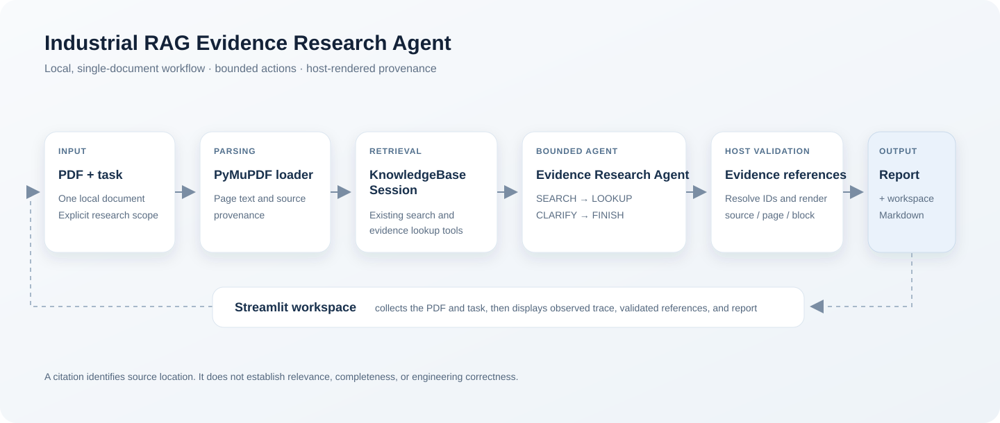
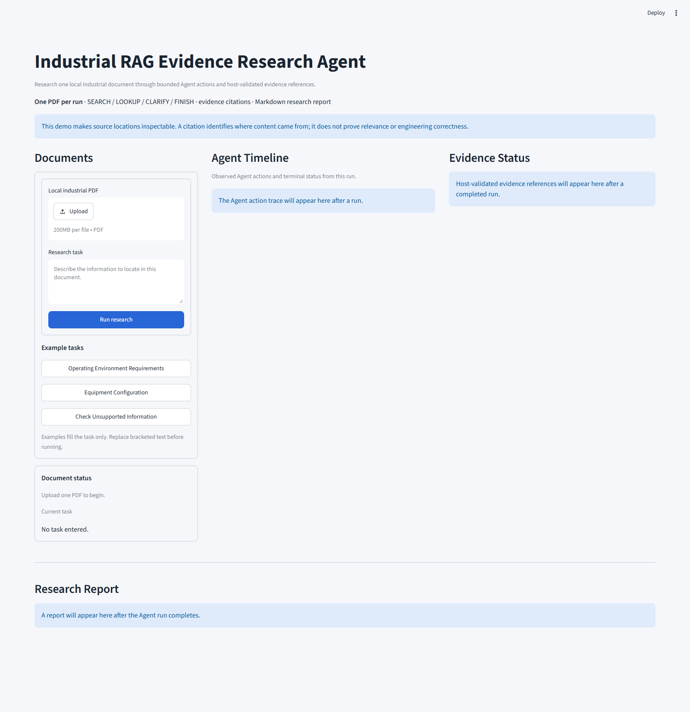
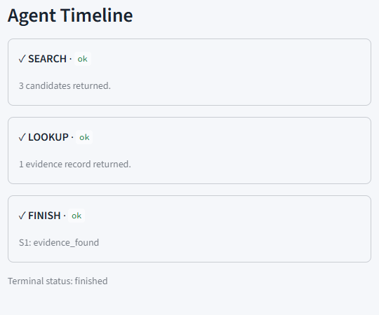

# M13.3 — Industrial RAG Agent Demo Package

**Status:** Complete as a local first-version demonstration package  
**Date:** 2026-10-04

## Purpose and boundary

M13.3 packages the existing local Evidence Research Agent so a reviewer can
understand the system, launch the Streamlit workspace, try the three M12
scenario prompts, and inspect the actions, source references, and Markdown
report. It finalizes the presentation package and documentation, declares the
Streamlit dependency, ignores local browser snapshots, and removes a
machine-specific audit path from the offline rescore helper without changing
its scoring logic. The RAG baseline, retrieval settings, Agent action contract
and loop, citation validation, frozen benchmark, and Agent 1 semantic
comparator remain unchanged.

The demo uses one local PDF per run and the existing local Qwen/Ollama selector.
The Streamlit UI is synchronous: it displays the captured action trace after
the run returns. It does not stream or invent intermediate Agent actions.

## Architecture



The UI passes an uploaded PDF and task to the existing runner. PyMuPDF loads
the document, `KnowledgeBaseSession` provides the established search and
lookup tools, and `AgentHarness` runs bounded SEARCH / LOOKUP / CLARIFY /
FINISH actions. The host resolves selected evidence IDs and renders source,
page, block, and excerpt metadata. The UI presents the actual trace, neutral
scope status, host-rendered evidence, and generated Markdown report.
Agent SEARCH uses the existing `KnowledgeBaseSession` default of Hybrid
retrieval followed by BGE reranking; the standalone PDF RAG CLI retains its
Dense-without-reranking default.

## Run the demo

Install the Python dependencies from this directory and ensure the local
Ollama service is running with `qwen3:4b` available:

```powershell
python -m pip install -r requirements.txt
ollama pull qwen3:4b
python -m streamlit run app/streamlit_app.py
```

Install Ollama separately. If its service is not already running, start
`ollama serve` in another terminal. The existing sentence-transformers
retrieval model may download on first use.

The task and PDF are sent only to the local Agent/model runtime. On first use,
the existing retrieval model package may be downloaded from its publisher.

In the browser, upload one permitted PDF, click an example task button, review
or edit the task text, and select **Run research**. Example buttons populate
the task field only; they do not submit the form. Replace the bracketed field
in the unsupported-information template with one specific parameter. The PDF
is written to a temporary file only while PyMuPDF parses it. The temporary
file is removed before the Agent runs, and the UI result remains in Streamlit
session memory.

## Demonstration scenarios

| Example | Research task | Earlier M12 local CLI result | Interpretation |
| --- | --- | --- | --- |
| Operating environment | Find the operating-environment requirements in the selected specification. | `evidence_found`; one citation at physical PDF page 21, block `document:20`. | The earlier excerpt contained the requested parameter fields. A later UI run selected a different page; see the observed run below. |
| Equipment configuration | Find a target equipment row's quantity and configuration in the structured schedule. | `evidence_found`; one citation at physical PDF page 10, block `document:9`. | Provenance is page-level; it does not identify a table cell. |
| Unsupported information | Check whether **[specify one protocol or security parameter]** is supported by the selected specification. | The earlier M12 task for its particular target ended `insufficient_scope`; a candidate was looked up, no evidence ID was selected, and no citation was rendered. | Replace the bracketed item. Results for other parameters are not established by that run. |

These are demonstration workflows from M12, not benchmark cases. Live model
selection may differ from the earlier runs; the buttons do not guarantee the
listed outcome.

## M13.2 real UI observation

The real browser run used the 72-page local M12 industrial specification and
the existing local Qwen `qwen3:4b` selector. The actual trace was SEARCH (three
candidates) → LOOKUP (one evidence record) → FINISH with `S1:
evidence_found`. The selected citation resolved to physical PDF page 7, block
`document:6`. That page contains an instruction for suppliers to provide
operating-environment information; it does not contain the target parameter
values. In the earlier M12 CLI run for the same task, the Agent selected page
21, where the parameter fields appeared.

The UI workflow, host resolution, and cited page location were verified. The
page-7 selection was less useful for answering the requested task than the
earlier page-21 result. This run therefore demonstrates end-to-end plumbing
and provenance, while exposing a semantic evidence-selection limitation. It
is not counted as a successful retrieval of the requested values. No retrieval
parameter or Agent behavior was changed to improve this example.

The public screenshots below show the M13.3 empty workspace and the observed
Agent timeline from the previously validated M13.2 successful run. The timeline
is cropped from that browser capture to exclude the private source excerpt,
document name, evidence ID, and local path.





## M13.3 verification replay

A fresh Q1 replay was attempted through the updated UI on 2026-10-04. The PDF
loaded and SEARCH returned three candidates, but the following structured
action request to local Ollama returned HTTP 500. The Agent stopped with
`tool_error`; the UI displayed the actual SEARCH and SELECT-error trace, and
the generated report marked the run preliminary without a final citation.
Browser console inspection showed no errors or warnings. A separate minimal
local Ollama chat request returned HTTP 200, while the structured request's
error response matched the local model-runner/memory category. The exact
underlying runner message was not retained, so the cause cannot be narrowed
further from this run.

This replay did not reproduce the successful M13.2 run. It is recorded as a
local runtime limitation, not converted into evidence of an Agent or retrieval
regression. No model, Agent, retrieval, or benchmark behavior was changed.

## Capabilities and limits

Implemented and demonstrated:

- one local PDF upload and temporary-file cleanup after parsing;
- bounded SEARCH / LOOKUP / CLARIFY / FINISH execution through the existing
  Agent harness;
- host validation and rendering of selected evidence IDs with source, page,
  block, and excerpt;
- neutral per-scope status and Markdown research report generation;
- visible trace of actions and terminal status from the actual run.

Not established or implemented:

- reliable semantic selection of the most relevant passage for every task;
- parser fidelity for every layout, OCR region, or table relationship;
- document-wide absence from an empty/insufficient retrieval result;
- claim-level support, engineering correctness, safety, or compliance;
- engineering diagnosis or recommendations;
- multi-document UI, persistent history, accounts, or online deployment.

A host-validated citation establishes which source location was rendered. It
does not establish that the excerpt is relevant, complete, or correct. The
existing PyMuPDF representation is page-level and does not expose table-cell
coordinates. Generated CLI reports can contain task text and source excerpts
and stay under ignored `outputs/agent11/`; do not publish those local reports
or source files. The offline Agent 0.3 rescore helper now receives its private
audit directory through `--audit-root` or `AGENT03_AUDIT_ROOT`; this removes a
machine-specific path from tracked source without changing its scoring logic
or any frozen benchmark data. Local Playwright snapshots are ignored under
`.playwright-cli/`; only the sanitized images in `docs/assets/` are intended
for public presentation.

## Final assessment

The project now has a complete first local demo package: a reviewer can see
its architecture, install the existing dependencies, launch the UI, run a
bounded investigation, and inspect the trace and host-rendered references.
That is sufficient for a learning and technical demonstration, with the
evidence-selection limits above made explicit. This milestone closes the
first demo version; it does not establish readiness for industrial decisions
or production deployment. See the [V1 final assessment](v1-final-assessment.md)
and [V1 changelog](v1-changelog.md) for release-level conclusions.
